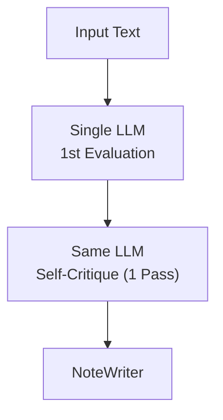
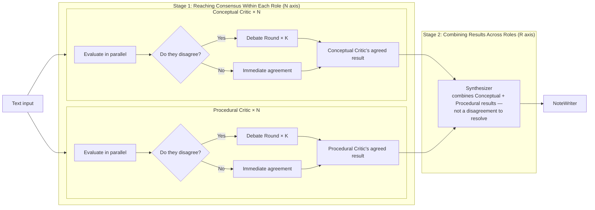
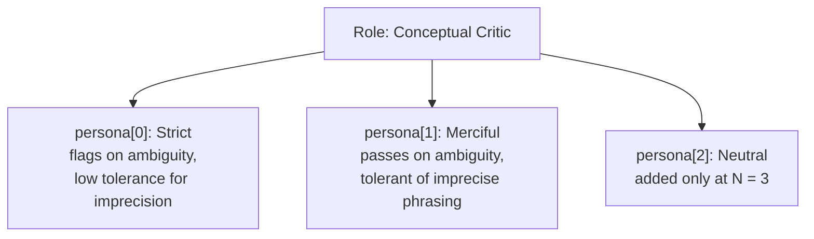
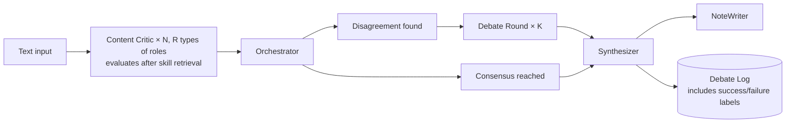
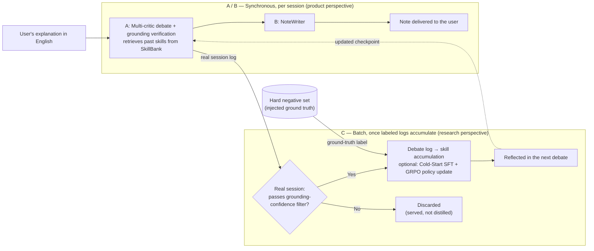

## 1. Abstract

---

FLETCHER is a text-based learning agent. User(a college student, for example) tells the agent about what he learned in the class, then the debate-based multi-critic system verifies user’s explanation with the grounded evidence, rebuts it when necessary, and evaluates the fidelity of the content. The result of the evaluation would be written in user’s own tone. Critics accumulate the rebuttal skills, which are distilled from debate experiences that were verified either by known ground truth or by strong grounding evidence, continuously update their decision policies through RL based on these experiences.

## 2. Project Goal

---

This project aims to answer the following questions.

### 2.1 Research Goal

---

**Question 1. Is debate-based multi-agent critique more effective than single-prompt critique for evaluating fidelity of the content?**

- How many tokens does each approach consume?
- How much latency does each approach incur?

**Question 2. Does increasing the number of critics and diversity of agents always lead to better performance?**

- Here, Diversity means persona diversity within the same role — critics that evaluate the same target with a different disposition, as opposed to R, which assigns critics to different targets.
- What specific point does performance actually start to decline?
- Aim to fine the quantitative answer to this progressively.

**Question 3. If critic accumulates the reusable evaluation skills in previous debate experiences, does utilizing these skills improve model’s actual performance?**

- Does skill retrieval improve accuracy compared to Architecture 2 (no skills)?
- Skill injection adds tokens to the prompt — how large is this overhead, and is the accuracy worthy?
- Compared to injecting the raw debate trajectory, does the distilled skill achieve similar accuracy at lower token cost? — SkillRL

**Question 4. How should the underlying LLMs be served, fine-tuned, and aligned to support this system?**

- Downstream of the LLM — during serving, inference, real usage.
- How should the multi-agent system be implemented?
- How should the agents conduct debate?
- How can the outcomes of debate experiences be distilled into reusable, compressed knowledge?

### 2.2 Learning Goal

---

**(0) Environment settings — ★★★☆☆**

- Why is GPU necessary?
- How many GPUs do we need? — vRAM vs. CPU RAM
- CUDA
- HuggingFace — Model loading, structure of pipeline
- Unsloth — light fine-tuning framework
- Colab, Docker, local venv + Github

**(1) Designing Multi-agent, role specialization, shared variable — ★★★★☆**

- LangGraph
- orchestration pattern
- Abstracting LLM call, implementing prompt
- shared variable / state isolation — race condition, message history, mutex
- Separate roles of agents
- structured output (Pydantic) — defining communication schema between critics
- ReAct, AutoGen

**(2) Sycophancy and Hallucination — ★★★★☆**

- Designing critics to detect errors
- Injecting deliberately incorrect explanations to test detection
- Sycophantic tendencies of small models
- Prompt-based suppression vs. fine-tuning-based suppression
- Causes and solutions of sycophancy — self-critique, debate
- Concept and causes of hallucination — parametric knowledge
- Data for training, evaluation and data synthesis

**(3) Minimizing Debate and Latency — ★★★★★**

- Local model limitation
- Multi-agent debate, debate structure (critic / judge)
- Identifying the causes of inference latency
- Minimizing latency — asyncio, concurrency, GIL, early stopping
- KV Cache, Flash Attention, Paged Attention
- vLLM, GPU parallelism

**(4) Grounding / RAG — ★★★☆☆**

- RAG, embedding, grounding
- Docker, Kubernetes (if serving/isolating critics across multiple containers)

**(5) Personalization — NoteWriter — ★☆☆**

- Style transfer / persona-preserving prompting
- Few-shot-based tone reproduction vs. fine-tuning-based tone reproduction

**(6) Skill-Based Self-Improvement (Self-Improving Agent) — ★★★★★**

This section is based on 2 papers: SAGE, SkillRL

- Experience distillation — extracting reusable skills from successful/failed debate process(SkillRL)
- Hierarchical skill library design — general skills vs. task-specific skills (SkillRL)
- Skill retrieval — dynamic retrieval based on semantic similarity (SkillRL)
- GRPO (Group Relative Policy Optimization) — policy updates without a critic model (SAGE)
- Skill-integrated reward design — outcome reward + skill-reuse reward + anomaly penalty (SAGE)
- Sequential rollout / recursive skill-policy co-evolution (SAGE, SkillRL)
- Unsloth fine-tuning, post-training, reinforcement learning (RL)

## 3. Desing Principles

---

### 3.1 FLETCHER — A Critic That Guards Against Self-Sycophancy

---

In the movie Whiplash, Fletcher never gives easy praise. In FLETCHER, this theme targets not about flattering the user but stopping the critic itself from checking the user’s explanation too quickly and approving it without noticing mistakes (self-sycophancy). When several critics question and challenge each other’s judgments (debate), a mistake that one critic misses can be caught by another critic.

→ Learning Goal (2) "Causes and solutions of sycophancy — self-critique, debate" / (3) "Multi-agent debate, debate structure (critic / judge)”

### 3.2 Grounded Content Critic

---

If the critic judges accuracy only using what it already knows (its own training knowledge — parametric knowledge), it might approve an answer that still contains the same mistake user made. This is because the critic has no outside source to check against. — hallucinations. The Content Critic fixes this by searching lecture materials and papers, utilizing RAG, and comparing the user’s explanation against these actual materials.

→ Learning Goal (2) "concept and causes of hallucination — parametric knowledge" / (4) "RAG, embedding, grounding"

### 3.3 Debate — Why Multi-Agent

---

There is no different from calling single LLM many times if each critic just checks its own part and the results are simply put together sequentially, which is the division and merge of labor. — not a multi-agent. The true value of multi-agent comes from the process of approaching to consensus during debating — disagree with the common eval target, challenge each other and work toward the same conclusion.

Proving this disagreement and challenge process actually improves accuracy is the main goal of this research.

→ Learning Goal **(1)** "orchestration pattern, separation of concerns" / **(3)** "multi-agent debate"

### 3.4 Personalization — Notes in the User’s Own Tone.

---

NoteWriter takes the user’s explanation, and the result of the debate, write down the note for that contents.

→ Learning Goal (5) "style transfer / persona-preserving prompting”

### 3.5 Accumulating Skills — Not Throwing Away Experience

---

Even if debates make the critics improve the accuracy every time, if critic starts form the beginning every single session, the time and cost never go down. SKILLRL points out that saving every raw trajectory is wasteful, redundant and noise-heavy, suggests pulling out only the useful parts of past experience. FLETCHER follows this idea. Whenever a critic successfully catches a misconception during debate or misses one, that experience is turned into a skill, distilled, and saved in SkillBank for that critic. The next time a similar debate happens, the critic can look up and retrieve that skill.

→ Papers referenced: SkillRL — experience-based distillation, hierarchical SkillBank / SAGE — GRPO-based policy optimization, skill-integrated reward, Sequential Rollout (detailed mapping in 4.3)

→ Learning Goal (6) entire category / (2) "post-training, reinforcement learning" / (3) "identifying the causes of inference latency"

---

## 4. System Architecture

---

### 4.1 Architecture 1 — Self-Critique (single-agent baseline)

---



This is the "single-prompt critique" baseline from Question 1. The same LLM checks its own output one more time — this is the comparison point that shows whether we even need multiple critics.

→ Learning Goal **(2)** "self-critique"

### 4.2 Architecture 2 — Multi-agent Debate

---



#### 4.2.1 Role specialization

---

The Content Critic is split into two roles (R = 2). The **Conceptual Critic** checks whether the concepts and definitions themselves are correct, using RAG to compare against the concept-explanation parts of the lecture material. The **Procedural Critic** checks whether the steps and order of applying a concept are logically correct, using RAG to compare against worked examples and proofs in the lecture material. Because the two critics search for different material and use different evaluation criteria, this role separation has real practical meaning. This same separation carries over into the SkillBank in 4.3, where each critic accumulates its own independent set of skills. A Completeness Critic — which would require curriculum-level ground truth (e.g., a table of contents or a concept graph) — will be added as a third role once the RAG infrastructure is expanded.

→ Learning Goal **(1)** "separation of concerns"

#### 4.2.2 Size of Ensemble

---

N controls how many critics of the same role run in parallel. These N critics are not identical copies. If they shared the same model. prompt, input, and seed, their outputs would be almost identical, no disagreement would arise, leading debate never triggers (round = 0). N would be indistinguishable from N = 1. In order to make N meaningful, each critic within a role is assigned a distinct persona along a single Strict-Merciful axis.



- **Strict / Merciful** — differ in judgment threshold, not in _what_ they evaluate. Both a Strict and a Merciful Conceptual Critic look at the same concept against the same retrieved material; they differ only in how readily they flag it.
- **N = 2** → {Strict, Merciful}; **N = 3** → {Strict, Merciful, Neutral}.

This axis is chosen because it structurally induces disagreement on exactly the cases that matter: a hard negative that a Merciful critic waves through is precisely what a Strict critic is built to catch. Persona diversity is therefore the engine that gives both majority vote (N critics) and debate (round > 0) something to actually resolve.

**Axis separation (N vs. R).** Persona is orthogonal to role and must stay that way:

- **R (role)** = _different evaluation target_ — Conceptual sees concepts, Procedural sees procedure.
- **N (persona)** = _different disposition on the same target_ — Strict vs. Merciful on the same concept.

Persona is always nested inside a role. A Strict persona attached to the Conceptual role and a Strict persona attached to the Procedural role are different instances. This keeps the N-effect and the R-effect cleanly attributable.

→ Learning Goal **(1)** "orchestration pattern" / **(3)** "GPU parallelism"

#### 4.2.3 Debate depth

---

K — Controls how many rebuttal rounds are allowed when critics disagree and what the stopping condition is. K applies only within Stage 1, which is for the disagreement among critics sharing the same role. Stage 2 is for the combining results across roles, one-time synthesis step which does not involve debate rounds. For controlled comparison experiments, we use a fixed number of rounds by default, and later compare this against stopping early once consensus is reached.

→ Learning Goal **(3)** "multi-agent debate, debate structure", "early stopping"

### 4.3 Architecture 3 — Skill-Augmented Debate

---

This adds a per-critic SkillBank on the top of Architecture 2. It reorganizes the methods from 2 papers — **SAGE**(Reinforcement Learning for Self-Improving Agent with Skill Library) and **SkillRL**(Evolving Agents via Recursive Skill-Augmented Reinforcement Learning). — to fit the text-based critic evaluation problem.



#### 4.3.1 SkillBank Structure

---

The SkillBank is organized in two layers: general skills shared by every critic (domain-agnostic principles, e.g., "check whether the definition comes first and the example follows"), and task-specific skills kept separate for each critic (error patterns specific to the Conceptual or Procedural role). Retrieval is done dynamically based on semantic similarity.
→ Paper reference: SkillRL — hierarchical SkillBank

#### 4.3.2 Experience Distillation

---

From the debate log (6.8), trajectories are distilled based on a **success/failure label**. This label comes from two sources:

1. **Labeled hard negative set (primary).** For inputs where a misconception was deliberately injected (5.3), ground truth is known, so success (a critic correctly caught the hard negative) and failure (missed it, or raised a false positive) are labeled directly. This mirrors SkillRL, where the success/failure signal **r(τ)** comes from an environment reward — here the injected-label set plays that role.
2. **High-confidence real session (extension).** Real user explanations have no ground truth. We therefore label only a **high-confidence subset**: cases where critic consensus is strong _and_ a retrieved lecture passage directly contradicts (or directly supports) the user's claim. When both conditions hold, the grounding itself acts as a weak verifier and the case is labeled; otherwise the session is discarded, not distilled. This is self-training with confidence filtering — the RAG grounding infrastructure (5.4) is reused as an automatic labeler.

Successful trajectories are distilled into strategy patterns ("this type of misconception is caught by this kind of rebuttal"). Failed trajectories are distilled into lessons learned ("the critic was too lenient with this kind of phrasing").

→ Paper reference: SkillRL — experience-based distillation mechanism

#### 4.3.3 Policy Improvement

---

We improve the critic's skill utilization in **three stages**, in this order:

**(1) Skill retrieval on/off sweep.** First measure the effect of retrieval itself — does injecting a retrieved skill into the prompt change accuracy at all?

**(2) Cold-Start SFT.** Small models (Qwen2.5-3B/7B) do not know _how_ to use a retrieved skill — simply providing skills to an unchanged model yields limited benefit. Following SkillRL's Cold-Start finding (removing it dropped their accuracy from 89.9 to 65.2), we first teach the critic to retrieve, interpret, and apply skills via SFT on demonstration trajectories, **before** any RL. Without this stage, a null result on S=on is uninterpretable: we cannot tell whether the skill was useless or whether the model simply failed to use it.

**(3) GRPO.** Only then do we run GRPO to further improve the policy toward better skill utilization. The reward combines an outcome reward (hard negative detection accuracy), a skill-reuse reward (given when a past skill is actually used to reach the correct answer), and an anomaly penalty (structured-output schema violation).

Skill retrieval happens in real time on every user request, but Cold-Start SFT and GRPO run **asynchronously as a separate batch process** once enough labeled debate logs have accumulated. While training runs, the existing critic checkpoint keeps serving; the new checkpoint is swapped in only after training completes. Accordingly, the latency measurements in 6.3 cover only the inference path (including retrieval) and exclude all training time.

→ Paper reference: SAGE — GRPO, skill-integrated reward, Sequential Rollout / SkillRL — Cold-Start SFT

#### 4.3.4 Experiment Order

---

Sweeping S at the same time as R/N/K would make it impossible to isolate what is actually causing changes in accuracy. Therefore, following the research progression in 2.1, we first fix the optimal combination of R/N/K, and only then sweep S on/off on top of that fixed configuration.

### 4.4 NoteWriter — Personalized Review Note Writing

---

The input is the critics' structured, corrected feedback (the Synthesizer's output), and the output is the final review note rewritten in the user's own tone. The MVP reproduces the user's tone through few-shot prompting, using samples of the user's past notes or explanations in the prompt; once enough data accumulates, this shifts to fine-tuning the style itself with Unsloth. This component is completely separate from the critics' judgment logic, and attaches in the same way regardless of which architecture (1, 2, or 3) is used.

→ Learning Goal (5), entire category

### 4.5 Pipeline Flow

---



A and B run synchronously in every session. C runs as a batch process — but only on **labeled** trajectories. Ground truth comes either from the hard negative set, or from real sessions that pass the grounding-confidence filter (4.3.2). Sessions that fail the filter are served normally but not used for distillation.

---

## 5. Challenges to Understand

### 5.1 How to define and detect disagreement?

---

**(a) Inducing disagreement.** Before we can detect disagreement, disagreement has to exists. Identical critics never disagree, so we deliberately seed variance via the Strict–Merciful persona axis (4.2.2). The goal is to make critics disagree on difficult or ambiguous cases, while still agreeing on clear and correct inputs. If the personas are too different, they may disagree even on obvious cases, leading to unnecessary debate and more false positives. Therefore, choosing an appropriate level of difference between personas is important design consideration.

**(b) Detecting disagreement.** The Orchestrator’s criterion for consensus reached and disagreement found must not be vague. First need to decide whether critics’s evaluations are numeric scores like judged by a threshold difference or text evaluations like requiring a separate judgment model. IF the criterion is too loose, debate is triggered every time, making the round = 0, and the round > 0 comparison meaningless. If it is too strict, on the other hand, cases are almost always treated as consensus, so that we lose the chance to measure the effect of having multiple agents at all.

→ Learning Goal **(1)** "orchestration pattern"

### 5.2 Debate stopping condition — preventing endless debate

---

How does performance change as critics keep debating, and how many rounds is reasonable? We start with a fixed number of rounds to keep the comparison experiments controlled, and later compare this against stopping early, once consensus is reached, or having a judge agent make the final call.

→ Learning Goal **(3)** "multi-agent debate, debate structure", "early stopping"

### 5.3 Negetive test set — method to measure self-sycophancy

---

In order to measure whether a critic is being too complacent, we need a test set with known correct answers that can verify whether the critic actually catches mistakes. So create inputs where a misconception is deliberately injected into user’s explanation, and compare whether the single-prompt critic or the debate-based critic catches it better. This would be how we quantitatively measure the self-sycophancy.

→ Learning Goal **(2)** Causes and solutions of sycophancy — self-critique, debate

### 5.4 Self-labeling on real sessions — where do we trust the grounding?

---

Real user explanations have no ground truth, so we can only distill from them if we can label them automatically. The grounding (RAG) acts as a weak verifier, but this raises three problems:

**(a) Confidence threshold.** How strong must critic consensus and grounding contradiction be before we trust the auto-label? Too loose and we distill from wrong labels (poisoning the SkillBank — see 5.5 "risk of skills biasing the critic"). Too strict and almost nothing gets labeled, so real sessions contribute nothing.

**(b) Selection bias.** Only _clearly grounded_ cases get labeled, so the critic may learn to catch obvious errors well while never learning from hard, ambiguous cases. This bias must be reported as a limitation.

**(c) Verifying the verifier.** To trust the auto-labels at all, a held-out slice of real sessions must be **hand-labeled** and compared against the grounding-based auto-labels, to measure how often the automatic labeler is actually right.

→ Learning Goal (4) "RAG, grounding" / (2) "reinforcement learning, data synthesis"

### 5.5 Additional questions

---

- Handling latency
  → Learning Goal **(3)** "KV Cache, Flash Attention, Paged Attention", "vLLM, GPU parallelism"
- Reinforcement Learning Background
- The risk of skills biasing the critic
- SkillBank capacity, frequency, recency
- Serving optimization
- GPU infrastructure sizing for concurrent critics
- Synthesizer verdict

---

## 6. Eval Harness Design

### 6.1 Hypotheses

---

- **H1** (corresponds to Question 1): Architecture 2 with debate round ≥ 1 achieves significantly higher hard negative detection accuracy than Architecture 1 with round = 0.
- **H2** (corresponds to Question 2): As N and R increase, accuracy improves up to a certain point, then plateaus or declines.
- **H3-a** (accuracy): Adding skill retrieval (S = on) to the optimal structure from H1/H2 improves hard negative detection accuracy over Architecture 2 (S = off).
- **H3-b** (overhead): Skill retrieval increases input tokens and prefill latency relative to Architecture 2. We quantify this overhead and evaluate whether the accuracy gain justifies it.
- **H3-c** (efficiency vs. raw trajectory): Compared to injecting the full raw debate trajectory as context, distilled skills reach comparable accuracy at substantially lower token cost. _(This is what SkillRL's compression result supports — skill vs. raw trajectory, not skill vs. no-skill.)_

### 6.2 Comparison Targets

Architecture 1 (Self-Critique), Architecture 2 (Multi-agent Debate), and Architecture 3 (Skill-Augmented Debate) are run on the same input set. In addition, a **single-persona baseline** is included as a separate control — one Strict critic and one Merciful critic, each running alone with no debate. Unlike Architecture 2, which runs the personas together and lets them debate, this baseline isolates whether the accuracy gain comes from the debate/aggregation process itself, or merely from having a strict judge in the pool.

### 6.3 Independent Variables

| Variable                    | Definition                                                                                                                                                | Initial Experiment Range |
| --------------------------- | --------------------------------------------------------------------------------------------------------------------------------------------------------- | ------------------------ |
| Architecture                | Self-Critique vs. Multi-agent Debate vs. Skill-Augmented Debate                                                                                           | {1, 2, 3}                |
| Number of debate rounds (K) | Number of rebuttal rounds when critics disagree                                                                                                           | {0, 1, 2, 3}             |
| Ensemble size (N)           | Number of same-role critics running in parallel, each assigned a distinct persona along the Strict–Merciful axis (N=2: {Strict, Merciful}; N=3: +Neutral) | {1, 2, 3}                |
| Role diversity (R)          | Number of distinct critic roles (different evaluation targets)                                                                                            | {1, 2}                   |
| Skill usage (S)             | Whether the critic retrieves and uses skills from the SkillBank                                                                                           | {off, on}                |

### 6.4 Research Progression (Incremental)

---

1. **(baseline)** Measure each persona alone (Strict-only, Merciful-only) with no debate — establishes the "best single persona" bar that debate must beat.
2. Fix the number of rounds and sweep ensemble size (N) alone — Does adding personas along the Strict-Merciful axis improve over the best single persona?
3. Fix ensemble size and sweep role diversity (R) alone — "Does adding a different perspective improve accuracy?"
4. Combine the optimal points from 2 and 3, varying N and R together along with their interaction with debate rounds
5. On top of the optimal combination from 4, sweep skill usage (S) on/off

### 6.5 Dependent Variables

---

- **Evaluation accuracy** — measured on the Hard Negative test set, as the rate at which intentionally injected misconceptions are caught (recall), plus the rate at which normal explanations are incorrectly flagged (false positive)
- **Latency** — time from input to the final Synthesizer output (as noted in 4.3.3, this excludes GRPO training time and covers only the inference/retrieval path)
- **Token usage** — total input and output tokens consumed across the entire pipeline

### 6.6 Datasets

---

1. **Hard Negative test set** — inputs with intentionally injected, plausible misconceptions. Used both to measure critic detection ability and as the source of success/failure labels for Experience Distillation.
2. **Normal explanation dataset** — normal inputs where the user actually explains (or a synthetic explanation of) course content in English. Used to measure false positives and general latency/token usage.

Both datasets must be paired with the same lecture material used for grounding.

### 6.7 Reproducibility

---

The same input batch is used across every Architecture/K/N/R/S combination for fair comparison. Seeding is **two-level** to reconcile reproducibility with persona diversity:

- A single **master seed** fixes the entire experiment run, so the whole sweep is reproducible end-to-end.
- Within a run, each critic instance derives its own seed as master_seed + persona_id, so the N critics remain deterministically distinct rather than collapsing to identical outputs.

This way, rerunning with the same master seed reproduces the exact same per-critic behavior, while within any single run the personas stay genuinely diverse. Note that most persona divergence here comes from the **prompt-level** Strict/Merciful framing, not from sampling randomness — the seed scheme mainly guarantees that any remaining stochastic tie-breaks are reproducible.

The SkillBank state which skills were active at a given time is also version-controlled as part of the experimental conditions.

### 6.8 Preserving Debate Logs / SkillBank

---

Each critic's initial evaluation, the content of each rebuttal round, the final consensus, and the hard negative success/failure label are all stored in a structured format as part of the full debate log. This is preserved in full — not just the final score — because this log serves as the input to Experience Distillation and as data that may support future research.

---

## 7. Roadmap

### **Phase 0 — Closing the Loop**

---

Take course content explained in English as input → run it through a single Architecture 1 (Self-Critique) pipeline → produce text output. Since this needs to be comparable with Architecture 2/3 later, the LLM call abstraction layer is built first.

| Step | Description                                                                    | Learning Goal                            |
| ---- | ------------------------------------------------------------------------------ | ---------------------------------------- |
| 0-1  | Choose a model (Qwen2.5-7B / Llama-3.1-8B / Mistral-7B) + set up Colab GPU env | (0) GPU, Colab                           |
| 0-2  | Set up minimal repo skeleton (`pyproject.toml`, `venv`, Github)                | (0) Version control                      |
| 0-3  | Implement the LLM call abstraction layer                                       | (1) Abstracting LLM calls, prompt design |
| 0-4  | Implement the Self-Critique pipeline (Architecture 1)                          | (2) Self-critique                        |
| 0-5  | Implement a minimal version of NoteWriter                                      | (5) Personalization — NoteWriter         |
| 0-6  | Run the full pipeline end-to-end once via CLI to confirm it works              | — Integration check                      |

### **Phase 1 — Building Multi-agent Debate**

---

Split into Conceptual Critic and Procedural Critic, implement the Orchestrator's consensus/disagreement detection, implement fixed-round debate, and implement structured output (Pydantic) for communication between critics. The schema defined here is designed with the input format for 4.3's Experience Distillation in mind.

| Step | Description                                                                    | Learning Goal                         |
| ---- | ------------------------------------------------------------------------------ | ------------------------------------- |
| 1-1  | Learn LangGraph basics + build the graph skeleton                              | (1) LangGraph                         |
| 1-2  | Define the structured output schema (including fields needed for distillation) | (1) Structured output (Pydantic)      |
| 1-3  | Implement the Conceptual Critic and Procedural Critic separately               | (1) Separation of concerns            |
| 1-4  | Implement the Orchestrator's disagreement detection / consensus logic          | (1) Orchestration pattern             |
| 1-5  | Implement the Debate Round (fixed number of rounds, K)                         | (3) Debate structure                  |
| 1-6  | Implement the Synthesizer                                                      | — Assembly step                       |
| 1-7  | Connect the full Architecture 2 pipeline + confirm it works                    | (1) Shared variable / state isolation |

### **Phase 1.5 — Building the Eval Harness**

---

Build the first version of the Hard Negative test set, compare Architecture 1 vs. 2, and run the first N/R/K sweep (step 1 of the research progression).

| Step  | Description                                                                         | Learning Goal                                   |
| ----- | ----------------------------------------------------------------------------------- | ----------------------------------------------- |
| 1.5-1 | Build the first version of the Hard Negative test set (with success/failure labels) | (2) Designing critics to detect errors          |
| 1.5-2 | Build the normal explanation dataset                                                | (2) Data synthesis                              |
| 1.5-3 | Write code to measure accuracy, latency, and token usage                            | (3) Identifying the causes of inference latency |
| 1.5-4 | (baseline) Measure each persona alone (Strict-only, Merciful-only, no debate)       | (2) Designing critics to detect errors          |
| 1.5-5 | Run the Architecture 1 vs. 2 comparison                                             | — Executing research goal 1                     |
| 1.5-6 | Sweep ensemble size (N) alone — persona-based (Strict/Merciful/Neutral)             | (1) Orchestration pattern                       |

### **Phase 2 — Scaling Up Grounding & Roles**

---

Expand the Content Critic's RAG by separating the retrieval target per critic, and add the Completeness Critic. Run the N/R/K sweep steps 2 (role diversity) and 3 (combined search). The Strict/Merciful axis is kept as the single persona axis through Phase 1.5 to keep the N sweep cleanly interpretable.

| Step | Description                                             | Learning Goal              |
| ---- | ------------------------------------------------------- | -------------------------- |
| 2-1  | Build the vector DB, embed lecture materials            | (4) RAG, embedding         |
| 2-2  | Apply per-critic retrieval target separation            | (4) RAG, grounding         |
| 2-3  | Add the Completeness Critic                             | (1) Separation of concerns |
| 2-4  | Sweep role diversity (R) alone                          | (1) Separation of concerns |
| 2-5  | Search the N × R × K combination space                  | (3) GPU parallelism        |
| 2-6  | (Optional / research extension) Additional persona axis | (1) Orchestration pattern  |

### **Phase 3 — Skill-Based Self-Improvement & Serving Optimization**

---

On top of the optimal N/R/K combination found in 2-5, build Architecture 3 (Skill-Augmented Debate) and sweep the S (skill usage) axis. Afterward, apply local model serving optimizations and Unsloth fine-tuning. Cold-Start SFT preceded GRPO because SkillRL shows that skipping it makes any S=on result uninterpretable.

| Step  | Description                                                                                   | Learning Goal                      |
| ----- | --------------------------------------------------------------------------------------------- | ---------------------------------- |
| 3-0   | Learn reinforcement learning fundamentals (policy, reward, trajectory)                        | (6) RL background                  |
| 3-1   | Implement the Debate log → Experience Distillation pipeline                                   | (6) Experience distillation        |
| 3-2   | Build the hierarchical SkillBank (general/task-specific, per critic)                          | (6) Hierarchical skill library     |
| 3-3   | Integrate skill retrieval                                                                     | (6) Skill retrieval                |
| 3-4   | Sweep skill usage (S) on/off                                                                  | — Executing research goal 3        |
| 3-4.5 | Cold-Start SFT: teach the critic to retrieve/apply skills before RL                           | (6) SkillRL Cold-Start             |
| 3-5   | Strengthen critic policy with GRPO                                                            | (6) GRPO, reward design            |
| 3-6   | Apply KV Cache, Flash Attention, vLLM                                                         | (3) Serving optimization           |
| 3-7   | Run GPU parallelism experiments                                                               | (3) GPU parallelism                |
| 3-8   | Apply Unsloth fine-tuning                                                                     | (2) Unsloth                        |
| 3-9   | Run post-training / reinforcement learning experiments (reflecting 3-5 results)               | (2) Post-training, RL              |
| 3-9.5 | (Extension) Grounding-confidence self-labeling on real sessions + hand-label validation slice | (4) grounding / (2) data synthesis |
| 3-10  | Organize debate log / distillation data (preserved for future research)                       |                                    |

---

## 8. Tech Stack

| Area                         | Choice                                                                | Notes                                                                                                                |
| ---------------------------- | --------------------------------------------------------------------- | -------------------------------------------------------------------------------------------------------------------- |
| Compute environment          | Colab free T4 → Colab Pro if needed                                   | The M4 MacBook is used for light local inference and coding; training and serving multiple critics runs on Colab GPU |
| Model loading / serving      | HuggingFace Transformers, vLLM                                        | Serving multiple critic instances at once is what makes vLLM's multi-request serving essential                       |
| Acceleration / optimization  | CUDA, KV Cache, Flash Attention, Paged Attention, GPU parallelism     | Phase 3                                                                                                              |
| Fine-tuning / alignment      | Unsloth, GRPO, post-training, reinforcement learning (RL)             | Phase 3                                                                                                              |
| Skill management             | Custom-built SkillBank (separated per critic), semantic retrieval     | Phase 3, based on SAGE/SkillRL                                                                                       |
| Orchestration                | LangGraph                                                             | Handles parallel critic calls + the Orchestrator + debate round control                                              |
| RAG                          | Vector DB + lecture materials (retrieval target separated per critic) | Phase 2                                                                                                              |
| Data synthesis               | Hard Negative test set generation                                     | Phase 1.5                                                                                                            |
| Containerization / isolation | Docker, Kubernetes if needed                                          | Isolating critic instances and allocating resources                                                                  |
| Storage                      | SQLite + markdown notes                                               | Includes debate logs                                                                                                 |
| Version control              | Local `venv` + Github                                                 |                                                                                                                      |
| UI                           | Gradio / Streamlit → React                                            | Low priority                                                                                                         |

---

## 9. Directory Hierarchy

```
fletcher/
├── README.md
├── CLAUDE.md
├── pyproject.toml
├── fletcher/
│   ├── agents/
│   │   ├── content_critic/
│   │   ├── orchestrator.py
│   │   ├── synthesizer.py
│   │   └── note_writer.py
│   ├── architectures/
│   │   ├── self_critique.py
│   │   ├── debate.py
│   │   └── skill_augmented.py
│   ├── skills/
│   │   ├── distillation.py
│   │   ├── skill_bank.py
│   │   └── retrieval.py
│   ├── rag/
│   │   └── lecture_notes/
│   ├── finetuning/
│   ├── serving/
│   └── pipeline.py
├── eval/
│   ├── datasets/
│   │   ├── hard_negative/
│   │   └── normal/
│   ├── sweep_configs/
│   ├── debate_logs/
│   ├── metrics.py
│   └── run_comparison.py
└── ui
```

| Category             | Path                               | Description                                                     |
| -------------------- | ---------------------------------- | --------------------------------------------------------------- |
| **Agents**           | `agents/content_critic/`           | Conceptual Critic, Procedural Critic                            |
|                      | `agents/orchestrator.py`           | Consensus/disagreement detection, debate round trigger          |
|                      | `agents/synthesizer.py`            | Combines critic results into a final evaluation                 |
|                      | `agents/note_writer.py`            | Rewrites the evaluation as a review note in the user's tone     |
| **Architectures**    | `architectures/self_critique.py`   | Architecture 1                                                  |
|                      | `architectures/debate.py`          | Architecture 2 (R/N/K configurable)                             |
|                      | `architectures/skill_augmented.py` | Architecture 3 (S configurable)                                 |
| **Skills**           | `skills/distillation.py`           | Experience Distillation                                         |
|                      | `skills/skill_bank.py`             | Hierarchical SkillBank                                          |
|                      | `skills/retrieval.py`              | Semantic similarity based retrieval                             |
| **RAG**              | `rag/lecture_notes/`               | Retrieval targets separated per critic                          |
| **Training/Serving** | `finetuning/`                      | Unsloth, post-training, GRPO                                    |
|                      | `serving/`                         | vLLM, KV Cache, and other serving optimizations                 |
| **Eval**             | `eval/datasets/hard_negative/`     | Inputs with intentionally injected misconceptions               |
|                      | `eval/datasets/normal/`            | For false positive / general latency measurement                |
|                      | `eval/sweep_configs/`              | K/N/R/S combination experiment configs                          |
|                      | `eval/debate_logs/`                | Input to Experience Distillation, preserved for future research |
|                      | `eval/metrics.py`                  | Accuracy/latency/token measurement code                         |
|                      | `eval/run_comparison.py`           | Compares Architecture 1 vs 2 vs 3                               |
| **UI**               | `ui/`                              | Gradio/Streamlit → React                                        |

---

## 10. Progress Checklist

- [x] Project planning finalized
- [x] Architecture design (Architecture 1/2/3, R/N/K/S variables defined)
- [x] Design Rationale (3.1–3.5) finalized
- [x] System Architecture (4.1–4.5) finalized, including mermaid diagrams
- [x] Challenges to Understand (5.1–5.5) finalized, including RL background as a prerequisite
- [x] Eval Harness design (6.1–6.8) finalized
- [x] Roadmap (Phase 0–3) finalized
- [x] Tech stack finalized
- [x] Directory structure finalized
- [x] 0-1. Choose model + set up Colab GPU environment
- [x] 0-2. Set up minimal repo skeleton
- [ ] 0-3. Implement LLM call abstraction layer
- [ ] 0-4. Implement Self-Critique pipeline
- [ ] 0-5. Implement minimal NoteWriter
- [ ] 0-6. Confirm end-to-end pipeline works
- [ ] 1-1. Learn LangGraph basics + build skeleton
- [ ] 1-2. Define structured output schema
- [ ] 1-3. Implement Conceptual/Procedural Critic
- [ ] 1-4. Implement Orchestrator consensus/disagreement logic
- [ ] 1-5. Implement Debate Round (fixed number of rounds, K)
- [ ] 1-6. Implement Synthesizer
- [ ] 1-7. Connect full Architecture 2 pipeline, confirm it works
- [ ] 1.5-1. Build Hard Negative test set
- [ ] 1.5-2. Build normal explanation dataset
- [ ] 1.5-3. Write measurement code
- [ ] 1.5-4. (baseline) Measure each persona alone (Strict-only, Merciful-only, no debate)
- [ ] 1.5-5. Run Architecture 1 vs 2 comparison
- [ ] 1.5-6. Sweep ensemble size (N) — persona-based (Strict/Merciful/Neutral)
- [ ] 2-1. Build vector DB
- [ ] 2-2. Apply per-critic retrieval target separation
- [ ] 2-3. Add Completeness Critic
- [ ] 2-4. Sweep role diversity (R)
- [ ] 2-5. Search N × R × K combination space
- [ ] 2-6. (Extension) Add second persona axis (Literal/Charitable), test vs. single axis
- [ ] 3-0. Learn reinforcement learning fundamentals (policy, reward, trajectory)
- [ ] 3-1. Implement Debate log → Experience Distillation pipeline
- [ ] 3-2. Build hierarchical SkillBank
- [ ] 3-3. Integrate skill retrieval
- [ ] 3-4. Sweep skill usage (S) on/off
- [ ] 3-4.5. Cold-Start SFT — teach critic to retrieve/apply skills before RL
- [ ] 3-5. Strengthen critic policy with GRPO
- [ ] 3-6. Apply KV Cache, Flash Attention, vLLM
- [ ] 3-7. Run GPU parallelism experiments
- [ ] 3-8. Apply Unsloth fine-tuning
- [ ] 3-9. Run post-training / reinforcement learning experiments
- [ ] 3-9.5. (Extension) Grounding-confidence self-labeling on real sessions + hand-label validation slice
- [ ] 3-10. Organize debate log / distillation data (preserved for future research)
